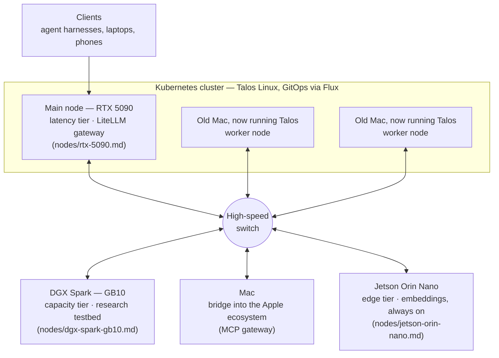

# The home lab, exposed

The topology the [node profiles](dgx-spark-gb10.md) live in. Everything
below hangs off one high-speed switch; the interesting part is the role
split.

## How the pieces relate

- **Main node (RTX 5090)** — the cluster's workhorse: fast interactive
  inference plus the LiteLLM gateway that makes both inference boxes one
  endpoint ([profile](rtx-5090.md)). Also carries the cluster's ingress,
  API management, and the multi-user agent gateway.
- **Worker nodes** — two retired Macs, repurposed as Talos workers: the
  cluster's services don't all need a GPU, and three nodes make it a
  cluster rather than a box with opinions.
- **DGX Spark (GB10)** — capacity tier and research testbed
  ([profile](dgx-spark-gb10.md)). Deliberately *not* a cluster node: one
  box, explicit memory budgeting, no scheduler moving things mid-benchmark.
- **Mac** — the bridge into the Apple ecosystem: exposes Mail, Calendar,
  Notes & Co. to agents via MCP
  ([mac-mcp-gateway](https://github.com/TechPrototyper/mac-mcp-gateway)),
  so cluster-side agents can act on Apple-side data without anything
  Apple running in the cluster.
- **Jetson Orin Nano** — the edge tier: two embedders (BGE-M3 and
  nomic-embed-text-v1.5, llama.cpp, full GPU offload) that keep retrieval
  warm no matter what the big boxes are doing, plus a small edge LLM on
  standby ([profile](jetson-orin-nano.md)). Also the designated home of
  the planned out-of-band management tool — the watcher that must live
  outside the failure domain it watches.
- **High-speed switch** — the reason two-stage retrieval (embed on one
  box, rerank on another) and gateway overflow routing are latency-free
  in practice.

The pattern in one sentence: **Kubernetes for everything that should be
declarative and multi-user; bare Docker for the one box where memory
layout is the experiment; a bridge host for the ecosystem that won't
containerize.**
