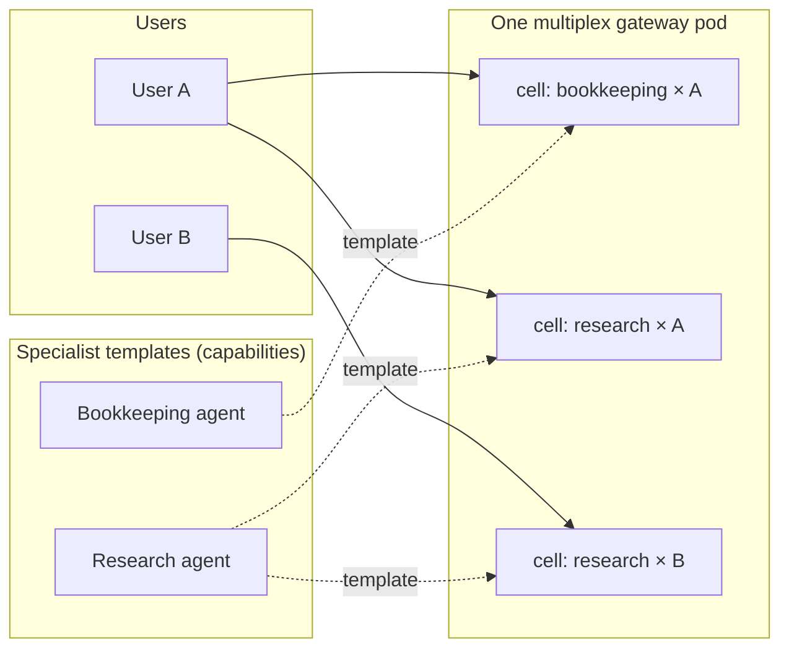

# Agent platform

Harness engineering ([previous track](../harness/README.md)) makes *one*
agent run well. This track is about serving **many**: multiple humans,
multiple specialist agents, one cluster — without the permission and
context soup that usually follows. Status: the concept is decided (ADR),
the upstream mechanics exist, provisioning and identity wiring are in
build. Documented now because the architecture is the interesting part.

## Cells: (specialist × user)

The core idea: an agent's context, skills, and permissions depend on two
independent dimensions — *what kind of agent is it* (a bookkeeping
specialist, a research specialist) and *who is it acting for*. The
combination is a **cell**, realized 1:1 as a Hermes **profile** (own
config, own persona, own skills, own memory, own credentials).

The rules that keep it clean:

- **Specialists are capabilities** — cataloged once (A2A agent card per
  template). **Cells are instances** — never in the catalog. *Who* is
  acting lives in the token, not in a registry.
- **One gateway process serves all cells** (Hermes' multiplex gateway:
  per-profile HTTP paths, per-profile keys, fail-closed, credential
  isolation down into MCP subprocesses). Separate pods only as a
  justified exception.
- **Identity via Keycloak** (per-cell service accounts), secrets from a
  vault via the cluster's secret operator, everything provisioned through
  GitOps — a cell is a merge request, not a snowflake.

## Cloud escalation with a data boundary

Each user's cells can carry an **escalation skill**: when the local model
isn't enough, the agent climbs a per-profile escalation ladder up to
cloud AI. Deliberate design: escalation is a *per-user provisioned
capability*, not a global default.

Planned on that path — and the part we find genuinely exciting — is a
**pseudonymization pipeline** at the boundary:

1. **Outbound**: entity names — people, companies, ledger accounts,
   project names — are replaced by stable placeholders before the prompt
   leaves the house.
2. The cloud model works on structure, not identities.
3. **Inbound**: the response is re-mapped, so results land in local
   records with the real entities restored.

The mapping table never leaves the cluster. Cloud capability, local
identities — both, not either/or.

## Where this stands

Honest ledger: profiles and the multiplex gateway are upstream Hermes
features (since v2026.8.x); the cell architecture is decided; today the
cluster runs a single default profile that existing consumers keep using
unchanged, and cells arrive additively. Identity resolution, cell
provisioning, and the permission model are the open construction sites —
followed by the pseudonymization pipeline. Findings will show up in the
[main table](../README.md#findings-so-far) as they become measurable.
